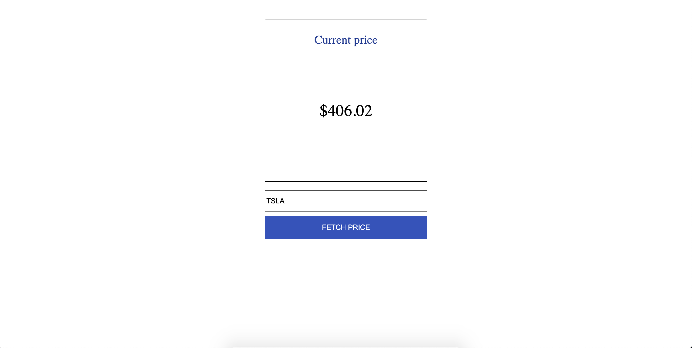

# Dose of Stocks

An application used as an example to show how you can make a form that
uses server as a proxy to make requests to external services
using Ruby on Rails.

Once the form is submitted with the symbol of the stock
(e.g. TSLA for Tesla stock) an external API (AlphaVantage API) is
called to get the current price of the stock.




## Getting started

Before you try to run the application make sure you
* have a Ruby version `2.6.3` installed
* have PostgreSQL driver `pg` installed

To install specific version of Ruby you can use [RVM](https://rvm.io/) or [rbenv](https://github.com/rbenv/rbenv).
### Creating database role
First, you must create the PostgreSQL role that will be used to create and
manage the application's database.

Within the PostgreSQL interactive terminal, type the following:
```
create role dose_of_stocks with createdb login password '<your-password>';
```
This statement will create a role `dose_of_stocks` with abilities to login, create a
database and with the password you provide.

### Setting an DB password environment variable

If you take a look at the file `config/database.yml` there is a section named `default` where the `password`
key has been set to
```
<%= ENV['DOSE_OF_STOCKS_DATABASE_PASSWORD'] %>
```

This means that the environment must contain a variable named `DOSE_OF_STOCKS_DATABASE_PASSWORD`.

To achieve that we can add this line within the startup file of your shell (`.bashrc`, `.zshrc` or similar file depending on the shell you use):
```
export DOSE_OF_STOCKS_DATABASE_PASSWORD=<your-password>
```

### Installing gems

While being in the project directory, execute
```
bundle install
```
to install gems from the `Gemfile`.

### Preparing database

There is one step left before we can run the application server - we must prepare our database.
To do that run the rake tasks with the command
```
rake db:create db:migrate db:seed
```

### Configuration for AlphaVantage API

To get the stock information through the AlphaVantage API you need to sign up for
a free API key and then set the environment variable
```
DOSE_OF_STOCKS_ALPHAVANTAGE_API_KEY
```

to the API key you received during sign up process.

Refer to `Setting an DB password environment variable` section above on how to
do that.

WARNING: AlphaVantage allows only limited amount of API calls for the day.
If your application is not working that might be the reason why.

### Starting application server

To start the application server run
```
rails s
```

By default the application will be accessible on `localhost:3000/`.
